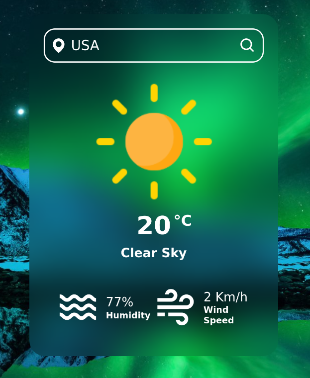

# Weather-App
-This app was developed with the aid of Vanilla HTML, CSS & Javascript.

-OpenWeather API with unit metric was used to fetch the weather details and render onto the screen with responsive pop up animations.

-Along with the temperature, details such as humidity and wind are also rendered.

-If an invalid location is entered, the app renders appropriate error message indicating the user of the error.

